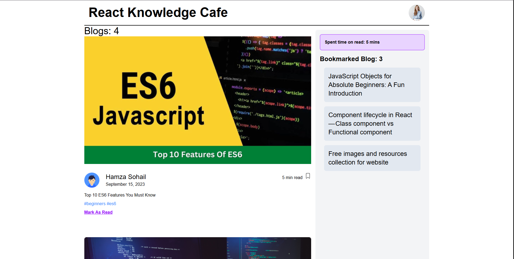

# 📚 Knowledge Cafe

A sleek and interactive blog-based web app where users can read and bookmark articles. Built with **React.js** and styled using **Tailwind CSS**.

🔗 **Live Demo:** [Knowledge Cafe on Surge](http://tacky-oil.surge.sh/)

---



## 🚀 Tech Stack

- **Frontend:** React JS
- **Styling:** Tailwind CSS
- **Deployment:** Surge

---

## 📝 Features

- 📄 Displays a list of blog articles with thumbnails and metadata
- 📌 Bookmark articles to a sidebar panel
- ⏱ Tracks time spent reading each article
- 📱 Responsive design for all devices
- ⚡ Super-fast deployment using Surge

---

## 🛠️ Installation & Setup Instructions

This project uses **React + Vite** for fast and modern development.

```bash
# 1. Clone the repository
git clone https://github.com/shohan89/knowledge-cafe
cd knowledge-cafe

# 2. Install dependencies
npm install

# 3. Start the development server
npm run dev

```
